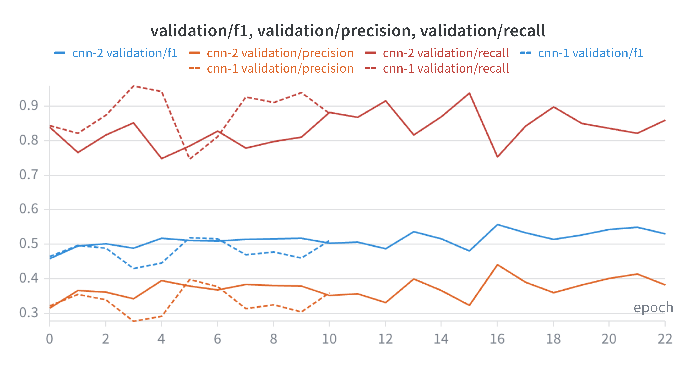
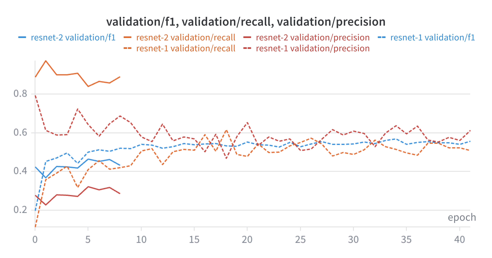
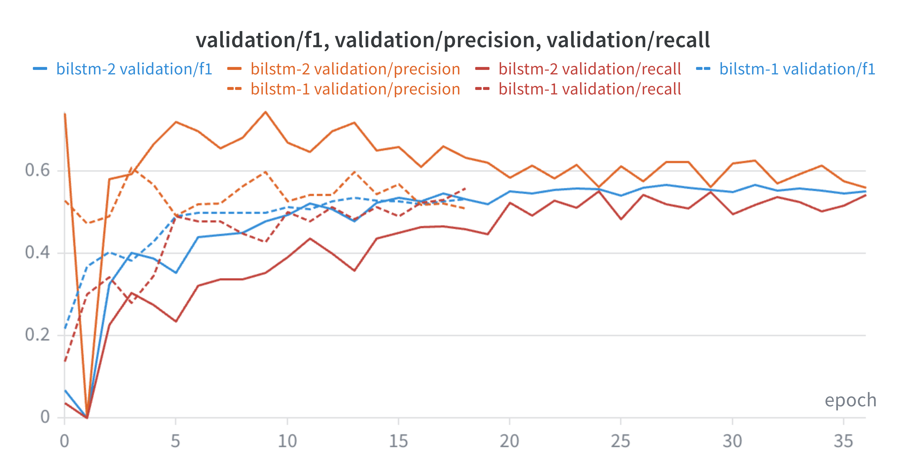
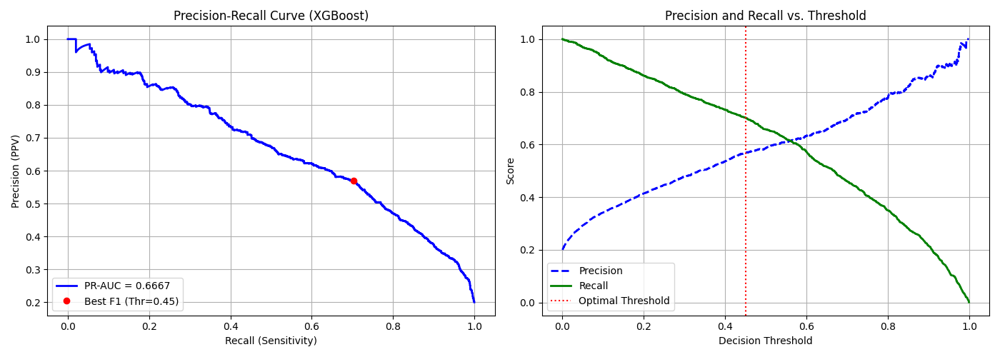

# Group 1: Exon and miRNA sequence classification

## Team Members

| Project Member Name | Roll Number |
| :--- | :--- |
| **Debmalya Sen** | 22BTB0A15 |
| **T. Dinesh** | 22BTB0A21 |
| **G. Sujith Charan** | 22BTB0A48 |

## Goal
This project is designed to accurately classify genomic sequences as either microRNA (miRNA) or Exons. Because miRNAs are relatively rare and generally much shorter than exons, this repository features specialized biological data-parsing, multiple Deep Learning (DL) architectures (CNN, ResNet1D, BiLSTM), and a highly tuned Feature-Engineered XGBoost pipeline to overcome sequence length disparities, class imbalance, and feature extraction challenges.

## Data Processing & Imbalance (`split_dataset_equally.py`)
Genomic sequences are extracted from FASTA and GFF files. The real-world genome is heavily biased towards exons, which massively outnumber complex functional non-coding RNAs like mature miRNAs. To create a realistic yet trainable dataset, we enforced a **4:1 Class Imbalance** (Exon to miRNA).

To handle variable sequence lengths (miRNAs are typically ~22nt, while exons are much longer), two approaches frame the biological context:
1. **Approach 1 (Random Slicing)**: Centers miRNAs into fixed 22nt frames using padding; randomly slices large exons down to exactly 22 nucleotides.
2. **Approach 2 (100nt Context Window)**: Extracts a wider 100 nucleotide segment. miRNAs are padded centrally so the model can learn their surrounding structural context, while exons are sampled using continuous 100nt windows.

## Deep Learning Pipeline (`model.py`)
A robust PyTorch pipeline configured for flexible sequence processing across Apple Silicon (`mps`) or NVIDIA GPUs.

### Architectures
*   **1D CNN (`RNACnn`)**: A baseline sliding convolutional kernel that sweeps across one-hot encoded RNA sequences to catch motifs. It features `AdaptiveAvgPool1d` to dynamically compress variable-length sequence matrices.
*   **1D ResNet (`RNAResNet1D`)**: A much deeper convolutional network utilizing custom `ResidualBlocks` with skip connections to learn deep hierarchical sequential patterns without vanishing gradients.
*   **BiLSTM (`RNABiLSTM`)**: Reads sequences bidirectionally to capture long-distance contexts and distant sequential dependencies (e.g., upstream promoters relative to loop regions).

### Problems Faced: The DL Performance Ceiling
Despite the complex architectures, the Deep Learning models plateaued early, consistently hovering around an **F1-Score of ~0.50**. 
1. **Spatial Instability**: Because of dynamic padding and random slicing, CNNs lost track of exact relative positions for crucial motifs. Pooling layers abstracted away too much spatial sequence specificity.
2. **Curse of Dimensionality**: One-hot encoding simple sequences (e.g., arrays of `[Batch, 4, Length]`) lacks rich semantic scale. Without massive pre-training (like a DNA-BERT), PyTorch effectively struggles to infer a deep "biological vocabulary" purely from sparse binary tensors on limited data.

### Precision-Recall Tradeoff & Optimizing Recall
The dataset's 4:1 imbalance poses a mathematical trap where a model can simply guess "Exon" 100% of the time and still achieve 80% accuracy. We combated this by penalizing the network using `BCEWithLogitsLoss(pos_weight=4.0)`. 

Furthermore, we explicitly optimized for **Recall** rather than finding a perfect F1 balance during DL training.
*   **False Negatives (low recall)** mean we completely overlook a novel piece of biology. In genomics finding rare elements is the entire goal.
*   **False Positives (low precision)** mean an exon is incorrectly flagged as a miRNA. This is highly acceptable in pipelines, since downstream bioinformatics tools (like *RNAfold* for thermodynamic hairpin stability validation) can easily act as secondary filters to discard these false hits. 
We deliberately lower the decision threshold to make the network "hyper-sensitive" to minority miRNAs.

#### CNN Validation Plot


#### ResNet Validation Plot


#### BiLSTM Validation Plot


## Traditional Machine Learning (`xgboost-tuned.py`)
Because neural networks struggled to extract meaningful representations from simple one-hot encoding, we pivoted to **Feature Engineering** and **Tree-based Boosting**.

### Why XGBoost Crushed the DL Models
Switching to XGBoost immediately bumped the F1-score to ~0.63+ with superior recall and precision curves. The main reasons for this:
1. **Motif Counting (Feature Logic) vs. Representation Learning**: Instead of abstracting 3D shape mappings from A/C/G/T numeric matrices, we generated **TF-IDF K-mers (2-mers to 5-mers)** and global **GC Content**. The tree checks a simple but profoundly biological rule: *"Does the motif 'ACGU' uniquely exist here in high frequency?"* bypassing the DL's "learning to read" phase.
2. **Position Independence**: TF-IDF K-mer counting focuses on the global tally of n-grams. It does fundamentally not care if the miRNA was padded on the left, right, or center, efficiently bypassing the "spatial instability" that broke the CNN global pooling layers.
3. **Automated Threshold Search**: The pipeline evaluates the model using an automated precision-recall curve computation. Rather than relying on a hard 0.5 boundary, it mathematically extracts the exact threshold that maximizes the target F1 response.

## Results (`model_eval_res.txt`)
The XGBoost model, optimized via `RandomizedSearchCV`, successfully isolated complex sequence structures across thousands of sparse text features.



**Best Parameters Found:**
```python
{'subsample': 0.9, 'scale_pos_weight': 5.0, 'n_estimators': 500, 'max_depth': 4, 'learning_rate': 0.2, 'gamma': 0, 'colsample_bytree': 1.0}
```

By shifting the decision threshold down to **`0.4498`**, the model prioritized Recall without destroying Precision:

```text
=> Optimal Decision Threshold: 0.4498 (Max F1: 0.6288)

--- Classification Report (Optimized Threshold) ---
              precision    recall  f1-score   support

    Exon (0)       0.92      0.87      0.89      4798
   miRNA (1)       0.57      0.70      0.63      1199

    accuracy                           0.83      5997
   macro avg       0.75      0.78      0.76      5997
weighted avg       0.85      0.83      0.84      5997
```
At a heavy 4:1 imbalance, securing a **0.70 recall** on the extreme minority miRNA class indicates that the TF-IDF feature space paired with Gradient Boosting effectively out-learned deep spatial networks.
