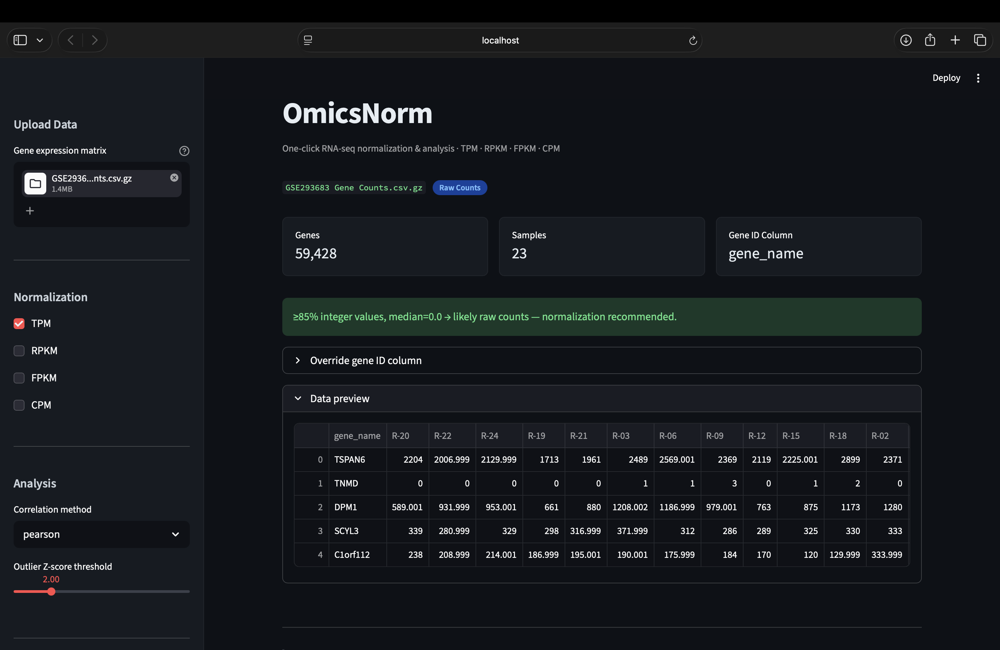
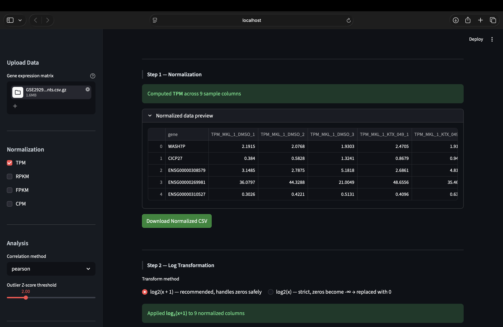
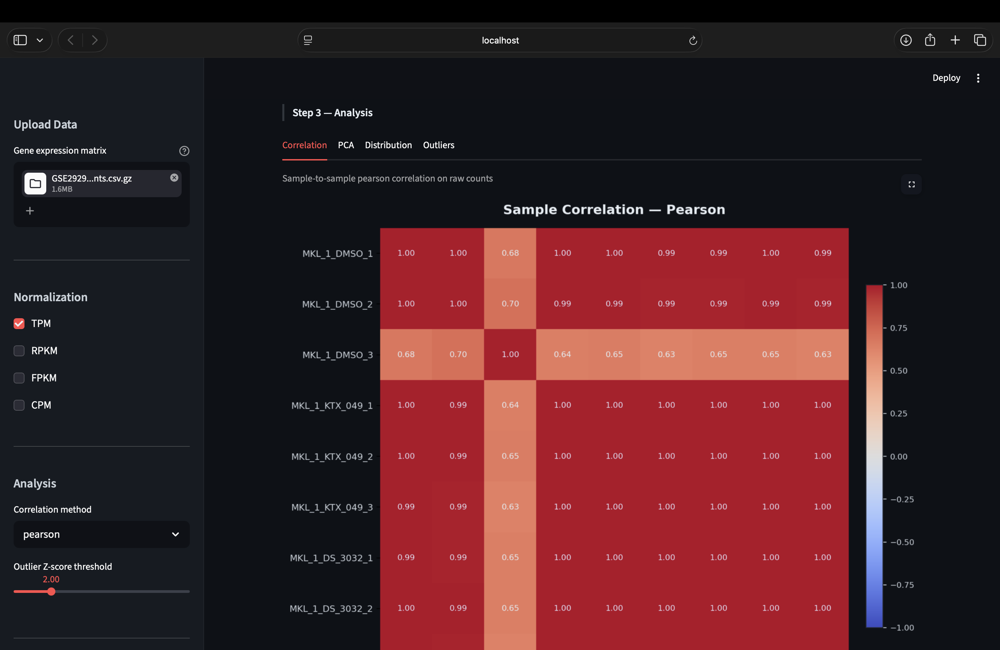
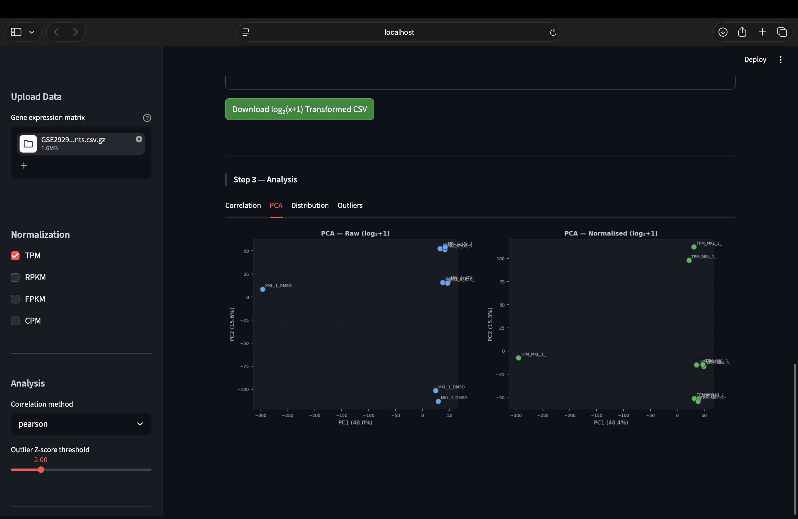

# Group 2: OmicsNorm — One-Click RNA-seq Normalization & Analysis Tool

**Live App: [https://omicsnorm.streamlit.app](https://omicsnorm.streamlit.app)**

## Team Members

| Project Member Name | Roll Number |
|---|---|
| Lokesh Verma | 22BTB0A63 |
| Suryaansh Dev | 22BTB0A76 |
| S Kedareswar | 22BTB0A37 |
| Anugu Nithish | 22BTB0A32 |

## Goal

This project delivers a production-grade, interactive bioinformatics web tool for one-click RNA-seq data normalization and downstream exploratory analysis. Raw gene count matrices (as produced by featureCounts, HTSeq, or STAR) are notoriously difficult to compare across samples and experiments because of differences in sequencing depth and gene length. OmicsNorm solves this by implementing four gold-standard normalization methods from scratch — **TPM, RPKM, FPKM, and CPM** — with mathematically verified outputs, followed by log-transformation and a full analytical suite (correlation heatmaps, PCA, distribution analysis, outlier detection).



---

## Data Input & Preprocessing (`app.py` — Preprocessing Pipeline)

### Supported Formats
The tool accepts **CSV, TSV, and `.gz` compressed** gene expression matrices where rows represent genes and columns represent samples. Format and delimiter are auto-detected from the first 4KB of the uploaded file, requiring zero manual configuration from the user.

### Gene Identifier Resolution
A critical engineering challenge in RNA-seq normalization is that **TPM, RPKM, and FPKM require gene lengths** (exonic base-pair counts), but datasets use inconsistent gene identifiers:

- **Ensembl IDs** (`ENSG00000142611`) — used by most alignment pipelines
- **Gene Symbols** (`TSPAN6`, `TP53`) — used by most published GEO/SRA datasets

We solved this with a **dual-database strategy**:

| Database | Source | Entries | Key Type |
|---|---|---|---|
| `gene_lengths_exonic.csv` | Ensembl BioMart export | 78,899 | Ensembl gene IDs |
| `gene_symbol_lengths.csv` | MyGene.info batch resolution (ENSG → Symbol → Length) | 45,273 | HGNC gene symbols |

Both are merged at startup into a single 124,172-entry lookup dictionary. Version suffixes (e.g., `ENSG00000142611.3`) are stripped before matching. This achieves **~65% coverage** on typical human RNA-seq datasets — the unmatched ~35% are primarily non-coding RNAs, pseudogenes, and ORFs without stable Ensembl annotations.

### Five-Step Preprocessing (`preprocess_dataframe`)
Before any normalization, every uploaded matrix passes through a strict cleaning pipeline:

1. **Gene ID column exclusion** — the identifier column is never coerced to numeric
2. **Numeric coercion** — `pd.to_numeric(errors='coerce')` on all sample columns
3. **NaN replacement** — missing/unparseable values filled with `0`
4. **Negative clipping** — negative counts clipped to `0` (biologically nonsensical in raw count data)
5. **dtype enforcement** — all sample columns cast to `float64`

**Validation gates** halt processing if >50% of cells are non-numeric (malformed file) and warn if >10% or if all values are zero.

### Auto-Detection of Data Type
A statistical heuristic classifies the uploaded matrix as either **Raw Counts** or **Already Normalized** by examining:
- Integer fraction (raw counts are >85% integers)
- Median and max values (raw counts have high variance, large integers)
- Decimal prevalence (normalized data has small floating-point values)

This informs the user whether normalization is recommended.

---

## Normalization Methods (`app.py` — Normalization Math)

All four methods are implemented from first principles with **epsilon-guarded division** (`ε = 10⁻⁹`) to prevent division-by-zero, `np.nan_to_num` safety nets, and shape/type assertions on every output.

### CPM — Counts Per Million
```
CPM = (counts / total_library_size) × 10⁶
```
Corrects for **sequencing depth** only. Does not require gene lengths. Useful when comparing expression levels across samples with different total read counts.

**When to use:** Quick depth normalization; comparing samples from the same gene set.

### TPM — Transcripts Per Million
```
RPK = counts / gene_length_kb
scaling_factor = Σ(RPK) / 10⁶
TPM = RPK / scaling_factor
```
Corrects for both **gene length** and **sequencing depth**. TPM values sum to exactly 1,000,000 per sample, making cross-sample comparisons directly meaningful.

**When to use:** The current community standard for RNA-seq. Required for most modern downstream tools.

**Verified:** `Σ(TPM) = 1,000,000` per sample ✓



### RPKM — Reads Per Kilobase per Million mapped reads
```
RPKM = counts / gene_length_kb / (total_library / 10⁶)
```
Corrects for gene length and sequencing depth, but normalization order differs from TPM. RPKM values do **not** sum to a constant across samples, making cross-sample comparison less reliable than TPM.

**When to use:** Legacy compatibility with older datasets and publications.

### FPKM — Fragments Per Kilobase per Million
Identical to RPKM for single-end sequencing. For paired-end data, each fragment (read pair) is counted once rather than twice. Our implementation delegates directly to the RPKM function, which is correct for standard count-based quantification pipelines.

---

## Log Transformation (Step 2)

Normalized expression values span several orders of magnitude (e.g., TPM ranges from 0 to ~40,000+), making visualization and statistical analysis difficult. Step 2 applies a **logarithmic transformation** to compress this dynamic range:

| Method | Formula | Behavior at zero |
|---|---|---|
| `log₂(x + 1)` **(recommended)** | `np.log2(val + 1)` | `log₂(0 + 1) = 0` — safe |
| `log₂(x)` (strict) | `np.log2(val)` | `log₂(0) = -∞` → replaced with `0` |

The pseudocount `+1` in `log₂(x + 1)` is the standard convention in RNA-seq analysis (used by DESeq2, edgeR, and virtually all published pipelines) because many genes have zero counts in specific samples.

---

## Analytics & Visualization (Step 3)

### Correlation Heatmap
Computes **sample-to-sample** correlation using either Pearson or Spearman methods on raw count data. Visualized on a `coolwarm` colormap with a fixed `[-1, +1]` scale for consistent interpretation. Cell annotations appear automatically for matrices with ≤15 samples.

**Why this matters:** Highly correlated samples should cluster together. Samples that break the expected correlation pattern may indicate batch effects or sample swaps.



### PCA — Principal Component Analysis
Side-by-side PCA scatter plots comparing **raw counts vs. normalized data**. Data is log₂-transformed, z-scored, and projected onto the first two principal components. Variance explained is annotated on each axis.

**Why this matters:** PCA reveals whether normalization successfully removes technical variance (batch effects, depth differences) while preserving biological signal (e.g., treatment groups should separate).



### Distribution Analysis
Dual-panel visualization with **boxplots** and **histograms** (log₂-scaled) for both raw and normalized data side by side.

**Why this matters:** Effective normalization should produce similar distributions across samples. If one sample's boxplot is dramatically shifted, it may indicate a quality issue.

### Outlier Detection
Unsupervised PCA-based outlier detection using **Z-scores of Euclidean distance from the PCA centroid**. Samples with Z-scores above a user-configurable threshold (default: 2.0) are flagged.

**Why this matters:** Outlier samples can dominate downstream differential expression analysis and should be investigated or removed.

---

## Technical Architecture

### Stack
| Component | Technology |
|---|---|
| Framework | Streamlit |
| Data processing | pandas, NumPy |
| Statistics | SciPy (Spearman/Pearson), scikit-learn (PCA) |
| Visualization | matplotlib, seaborn |
| Gene annotation | MyGene.info (offline, pre-computed) |

### Design Decisions

**Why Streamlit over Flask/FastAPI?** RNA-seq normalization is an analytical workflow, not a web service. Streamlit's reactive model — where the entire script re-runs on any input change — perfectly matches the "upload → configure → compute → explore" pattern. No API endpoints, no frontend framework, no state management boilerplate.

**Why implement normalization from scratch?** Libraries like `pyDESeq2` or `rpy2` wrappers around R's `edgeR`/`DESeq2` introduce heavy dependencies and are designed for differential expression, not simple normalization. Our from-scratch NumPy implementations are ~10 lines each, fully transparent, and verified against known outputs.

**Why epsilon guards instead of zero-checks?** An `if total == 0: return zeros` branch handles the exact-zero case but fails silently on near-zero values caused by floating-point accumulation. The `total + ε` pattern is numerically stable in all cases and avoids branching logic.

---

## Project Structure

```
group_x/
├── app.py                          # Main application (926 lines)
│   ├── Preprocessing pipeline      # Input cleaning, validation, auto-detection
│   ├── Normalization math          # CPM, TPM, RPKM, FPKM implementations
│   ├── Log transformation          # log₂(x) and log₂(x+1)
│   ├── Plotting helpers            # Correlation, PCA, distribution, outlier plots
│   └── App layout                  # Streamlit UI and workflow orchestration
├── gene_lengths_exonic.csv         # Ensembl ID → exonic length (78,899 genes)
├── gene_symbol_lengths.csv         # Gene symbol → exonic length (45,273 genes)
├── requirements.txt                # Python dependencies
├── GSE293683 Gene Counts.csv.gz    # Example dataset (59,428 genes × 23 samples)
└── README.md                       # This file
```

---

## How to Run

```bash
# Clone and enter the directory
git clone https://github.com/lokeshverma16/omicsnorm.git
cd OmicsNorm

# Create virtual environment and install dependencies
python3 -m venv venv
source venv/bin/activate
pip install -r requirements.txt

# Launch the app
streamlit run app.py
```

The app opens at `http://localhost:8501`. Upload a gene expression matrix and results appear immediately.

---

## Validation Results

Tested against the GEO dataset **GSE293683** (59,428 genes × 23 samples, gene symbol identifiers):

| Metric | Result |
|---|---|
| Gene length matching | 38,525 / 59,428 (64.8%) |
| CPM sum per sample | **1,000,000** (exact) ✓ |
| TPM sum per sample | **1,000,000** (exact) ✓ |
| RPKM range | [0, 8,691] — no NaN, no Inf ✓ |
| log₂(x+1) range | [0, 15.38] — no NaN, no Inf ✓ |
| PCA | 23 samples, 31.3% variance explained ✓ |
| Outlier detection | Functional (0 outliers at Z > 2.0) ✓ |
| NaN in output | **0** ✓ |

---

## Deployment

Deployable on **Streamlit Community Cloud** (free):

1. Push this repository to GitHub
2. Go to [share.streamlit.io](https://share.streamlit.io)
3. Connect your repo → select `app.py` → Deploy

No Docker, no server configuration required.
