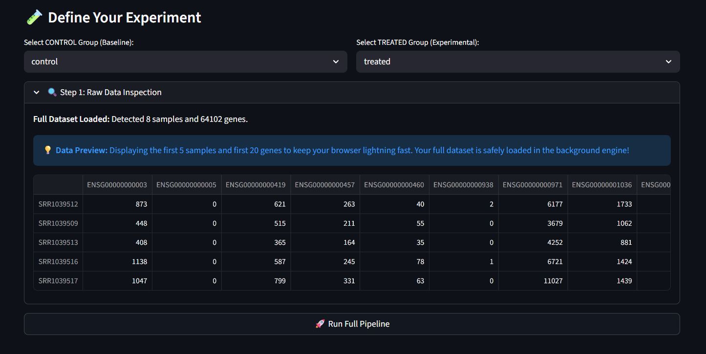
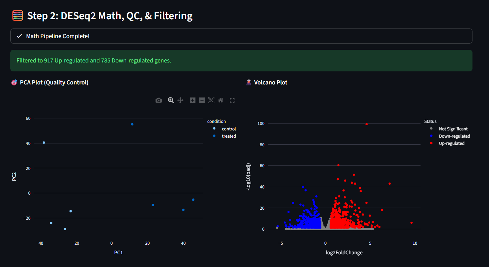
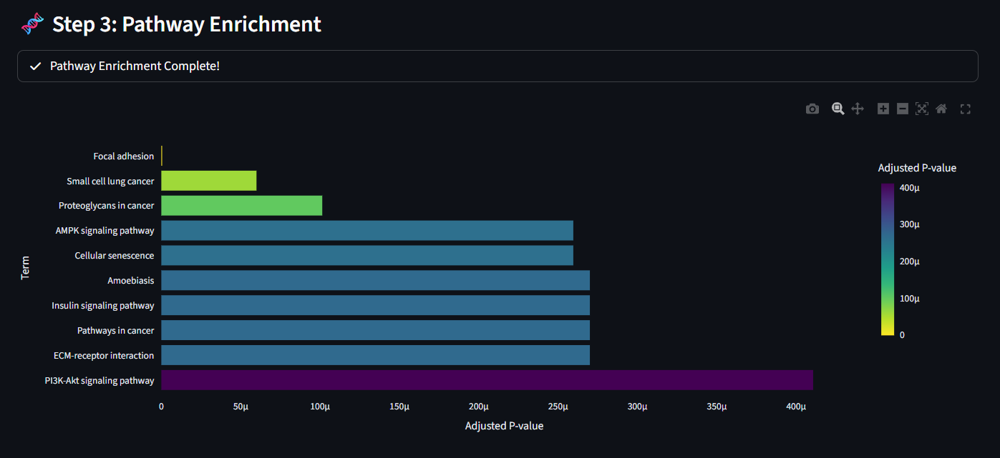
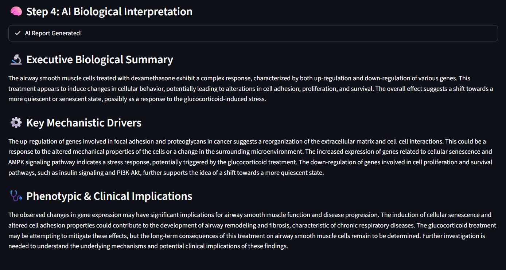

# 🧬 GenePath AI

**An Automated, End-to-End RNA-Seq Analysis and Biological Interpretation Platform**

GenePath AI is a comprehensive, web-based bioinformatics application developed using the Streamlit framework. The platform is engineered to bridge the translational gap between raw RNA-sequencing data and actionable biological insights. By integrating high-performance data processing, rigorous statistical differential expression analysis (PyDESeq2), and context-aware Large Language Models (LLMs), GenePath AI programmatically synthesizes high-dimensional transcriptomic matrices into coherent, mechanistically focused biological reports.

---

## 🌐 Live Demo

No installation needed — the app is deployed and ready to use instantly.

[](https://genepathai.streamlit.app/)

👉 **[https://genepathai.streamlit.app/](https://genepathai.streamlit.app/)**

Simply open the link, upload your counts matrix and metadata file, configure your parameters, and run the full pipeline — all from your browser.

---

## ✨ Key Features & Visual Workflow

### 1. High-Performance Data Ingestion & Preprocessing

Utilizes the Rust-based **Polars** engine to process high-dimensional datasets (exceeding 60,000 features) with minimal latency. It features an algorithmic formatting protocol that silently resolves whitespace issues, missing values, and transposed matrices.



### 2. Robust Statistical Framework (PyDESeq2)

Incorporates PyDESeq2 to perform robust differential expression analysis, calculating precise Log2 Fold Changes and adjusted P-values. The system dynamically maps baseline and experimental conditions directly from user-provided metadata.



### 3. Automated Pathway Enrichment

Programmatically converts Ensembl accession identifiers into standardized Gene Symbols via the MyGene API, cross-referencing significant genomic features against KEGG and Reactome databases to identify enriched cellular pathways.



### 4. LLM-Driven Biological Synthesis

Integrates open-source Large Language Models via the Hugging Face Inference API. Models are prompted with strict experimental parameters (tissue type, comparative conditions) to minimize hallucinations and focus exclusively on mechanistic drivers and clinical implications.



---

## 🛠️ Technical Stack

| Component | Technology |
|---|---|
| Application Framework | Streamlit |
| Data Engineering | Polars, Pandas |
| Statistical Analysis | PyDESeq2, SciPy |
| Biological APIs | MyGene |
| Data Visualization | Plotly |
| Artificial Intelligence | Hugging Face Inference API (Meta Llama-3 / Mistral) |

---

## 🚀 Installation & Setup

### 1. Clone the Repository

```bash
git clone https://github.com/yourusername/GenePath-AI.git
cd GenePath-AI
```

### 2. Establish a Virtual Environment

Run the following command to create a virtual environment:

```bash
python -m venv venv
```

Then activate it:

```bash
# Mac/Linux
source venv/bin/activate

# Windows (Command Prompt)
venv\Scripts\activate
```

### 3. Install Required Dependencies

Install all necessary packages using:

```bash
pip install -r requirements.txt
```

### 4. Configure AI Authentication

A valid Hugging Face Access Token is required to enable the LLM functionality.

1. Go to [Hugging Face](https://huggingface.co)
2. Navigate to **Settings → Access Tokens**
3. Generate a new token
4. Set the token as an environment variable:

```bash
# Mac/Linux
export HF_TOKEN="your_huggingface_token"

# Windows (Command Prompt)
set HF_TOKEN="your_huggingface_token"

# Windows (PowerShell)
$env:HF_TOKEN="your_huggingface_token"
```

> ⚠️ **Note:** If you are using Meta Llama-3, make sure you have accepted the model license on Hugging Face before use.

---

## 💻 Usage Protocol

### ▶️ Run the Application

Start the Streamlit server using:

```bash
streamlit run app.py
```

### 🔬 Analytical Workflow

#### Step 1 — Data Ingestion

Upload the required input files using the sidebar:

- Gene expression counts matrix (`.csv`)
- Metadata file (`.csv`)

> 💡 **Sample datasets** are included in the repository for immediate testing:
> - `airway_counts_formatted.csv` — example gene expression counts matrix
> - `airway_metadata_formatted.csv` — corresponding sample metadata

#### Step 2 — Parameter Definition

Define the biological context (for example, *Airway smooth muscle cells*) and select:

- Control group
- Treatment group

#### Step 3 — Pipeline Execution

Click the **🚀 Run Full Pipeline** button to start the analysis. The system will automatically perform:

- Differential expression analysis via PyDESeq2
- Pathway enrichment against KEGG and Reactome
- AI-based biological interpretation

#### Step 4 — Review & Export

After execution, you can:

- View PCA and Volcano plots
- Analyze enriched biological pathways
- Read the AI-generated biological summary
- Export results directly from the sidebar

---

## 📂 Project Structure

```
GenePath-AI/
│
├── app.py                          # Main Streamlit application entry point
├── data_engine.py                  # Data ingestion, preprocessing, and DESeq2 pipeline
├── llm_integration.py              # LLM API connection and prompt engineering
├── pathway_enrichment.py           # KEGG/Reactome enrichment and gene ID mapping
├── requirements.txt                # Python dependencies
├── airway_counts_formatted.csv     # Sample gene expression counts matrix
├── airway_metadata_formatted.csv   # Sample metadata file
├── README.md                       # Documentation
└── Pictures/                       # Screenshots for README
```

---

## 🤝 Contributing

Academic and technical contributions, issue reports, and feature requests are welcome.

- Check the **Issues** section of the repository for open tasks
- Submit pull requests for bug fixes or new features

---

## 📝 License

This project is licensed under the **MIT License**.
See the [LICENSE](LICENSE) file for full details.
